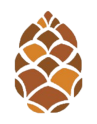

# pinap : project is not a project
> test :+1:
```diff
` ` `diff
- blabla
+ blabla
! blabla
@@ blabla @@
# blabla
` ` `
```
 ~~ok~~
```css
` ` `css
* {
display: none !important;
}
` ` `
```
- [x] blabla
- [ ] blabla

[links]()

** *blabla* **blabla**

__ _blabla_ __blabla__

~~ ~~blabla~~



|123456 | 123456 | 123456 | 123456 |
:-|:-:|-:|-|
| 0 | 1 | 2 | 3 |
